## Foundation Models in Medical Image Segmentation
This repository contains the code for the bachelor's thesis "Foundation Models in Medical Image Segmentation".  
The goal is to evaluate the performance of different foundation models on many different, especially medical, datasets and compare them to each other and to fully supervised models trained specifically for a certain dataset.


### Installation
For ease of use, a Makefile is included that creates virtual environments and installs the required packages.

```bash
make [all|train]
```

Of course, you can also manually pull all submodules, install dependencies and download the models if you prefer that.

IMPORANT NOTICE: If you use the makefile to download the checkpoints, you might need to give permission to the scripts that download the checkpoints.
You can do this by running `chmod +x download.sh` in the respective folders.

The `all` target creates both virtual environments, installs the dependencies and downloads the models.
This target is used for evaluating the models on the datasets (segFM).

The makefile automatically detects if an NVIDIA GPU is available and tries to install PyTorch with CUDA12.8 support. If your GPU requires a different CUDA version, be sure to install the correct pytorch version that fits your device. You can find the correct command [here](https://pytorch.org/get-started/locally/).


### Structure
- `.`: Root directory of the project. Code should be run from here.
- `Makefile`: The Makefile creates multiple virtual environments for the models used in the project and installs the required dependencies. It also downloads the models if they are not already present.
- `src/segFM`: Source code for the project.
- `src/segFM/predictors/`: Contains the code to run the different models on the datasets. Each predictor should have a `predict` and a `evaluate_model` function. Also contains the segmentation models as submodules.
- `src/segFM/DatasetEvaluation/`: Contains the code to evaluate the models on the datasets. Each subfolder
should contain a `eval.py` file that stores the results of the evaluation in a .csv file.
- `src/segFM/DataLoaders/`: Contains the Datasets. Each file represents a dataset
and contains a class that inherits from `base_dataset.py`. The class should implement the `__getitem__` and `__len__` methods.
- `src/segFM/MedMaskGenerator/`: Contains code that provides the functionality of the SAM2AutomaticMaskGenerator for MedSAM2 or similar models. Was a dead end, but kept for reference.
- `Datasets/`: Contains the datasets that are used in the project. Obviously, these are also not stored in the repository.

### Files
- `src/segFM/`: Contains the main code for the project.
  - `color_classes.py`: Contains mappings between color codes, IDs, and labels for various segmentation datasets.
  - `prompts.py`: Contains the Prompt class used for segmentation tasks and functions to generate prompts from ground truth segmentation masks.
  - `utils.py`: Contains utility functions that are used in the project, e.g. Dice and IoU calculation.
  - `logger.py`: Contains the logger configuration for the project.
  - `checkpoints.py`: Contains constants for the model checkpoints used in the project.

#### DatasetEvaluation Files
- `eval.py`: Evaluation script that calculates different metrics like Dice, IoU and NSD using the model and dataset that the folder is named after. Stores results in a .csv file.
- `plot.py`: Contains functions to plot the results of the results in the .csv file created by `eval.py`.
- `create_table.py`: Creates a latex table from the results in the .csv file created by `eval.py`. The table may be used
  in the thesis.
- `train.py`: Training script that trains the model on the dataset that the folder is named after.
- `utils.py`: Contains utility functions that are used in the project, e.g. Dice and IoU calculation

### Results
All results generated by the predictors are stored in a `.csv` file in the respective dataset folder.
The results are stored in the following format:

| Model | Dataset | n_pos | n_neg | bbsize | Mode | Prompt Finder | Image | Object | DSC | NSD | IoU |
|-------|---------|-------|-------|--------|------|---------------|-------|--------|-----|-----|-----|
- `Model`: Name of the model used for the evaluation.
- `Dataset`: Name of the dataset used for the evaluation.
- `n_pos`: Number of positive prompts used for each object
- `n_neg`: Number of negative prompts used for each object
- `bbsize`: Size of the bounding box padding, only relevant if the mode is "box" or "both" (e.g. 10 for a 10 pixel padding, 0 for no padding).
- `Mode`: Mode of the prompt used (e.g. "point", "box", "both").
- `Prompt Finder`: Name of the prompt finder used (e.g. "random", "yolo", etc.).
- `Image`: Name of the image used
- `Object`: Name of the object
- `DSC`: Dice Similarity Coefficient metric
- `NSD`: Normalized Surface Dice metric
- `IoU`: Intersection over Union metric

#### BAGLS

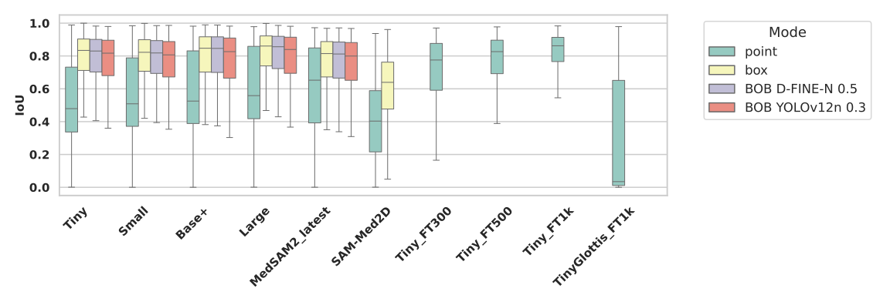

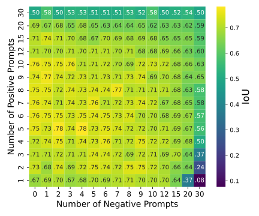


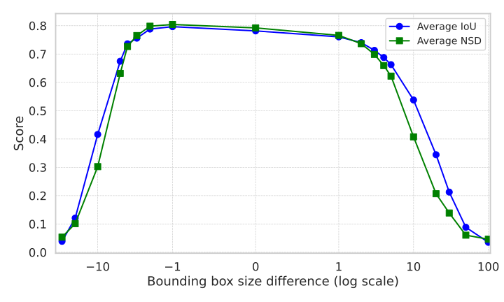

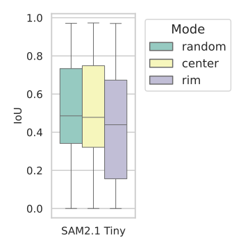

#### VFSS

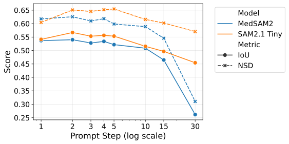

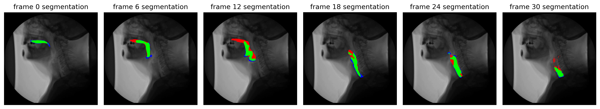

#### Endoscapes

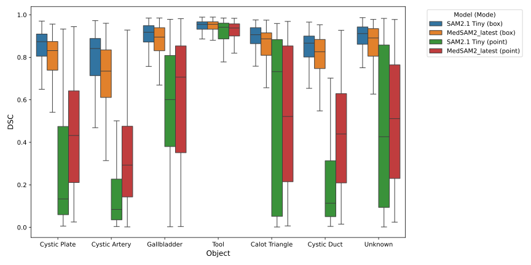

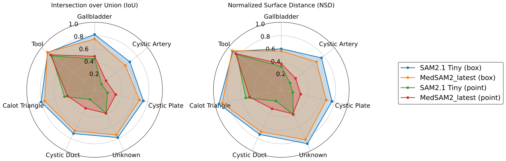

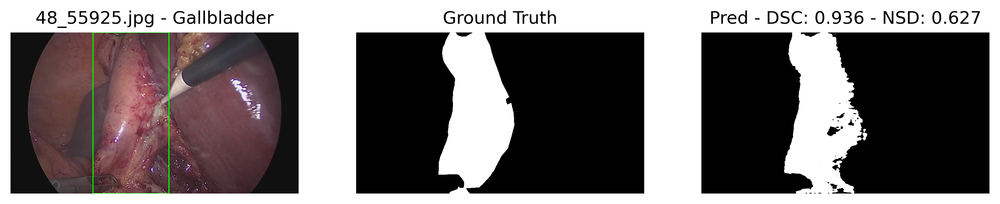

#### IMed361M

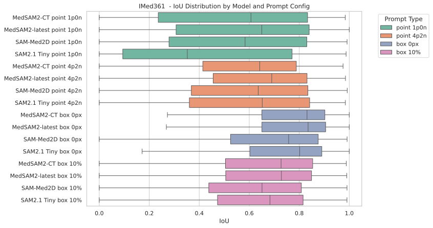


#### MedSegBench

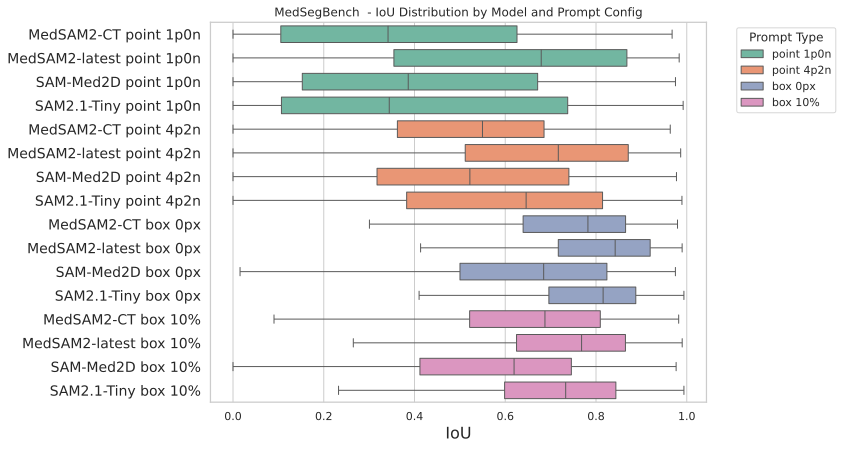

#### FLARE22 

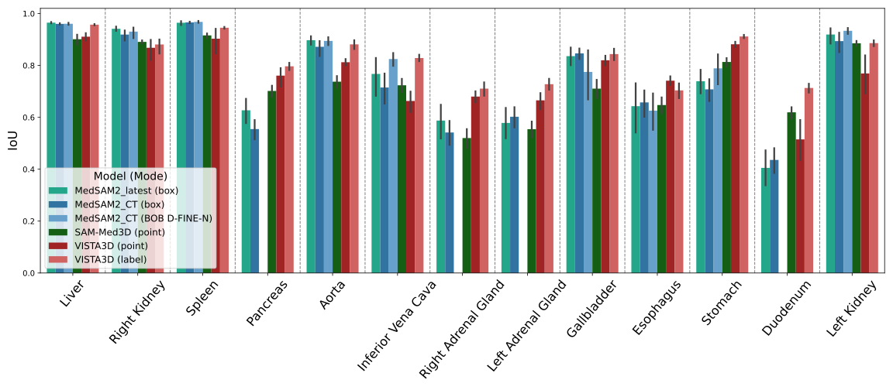

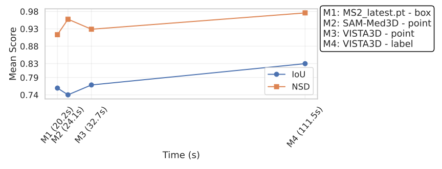

#### Medical Segmentation Decathlon

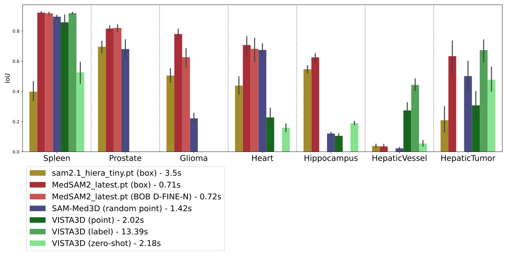

